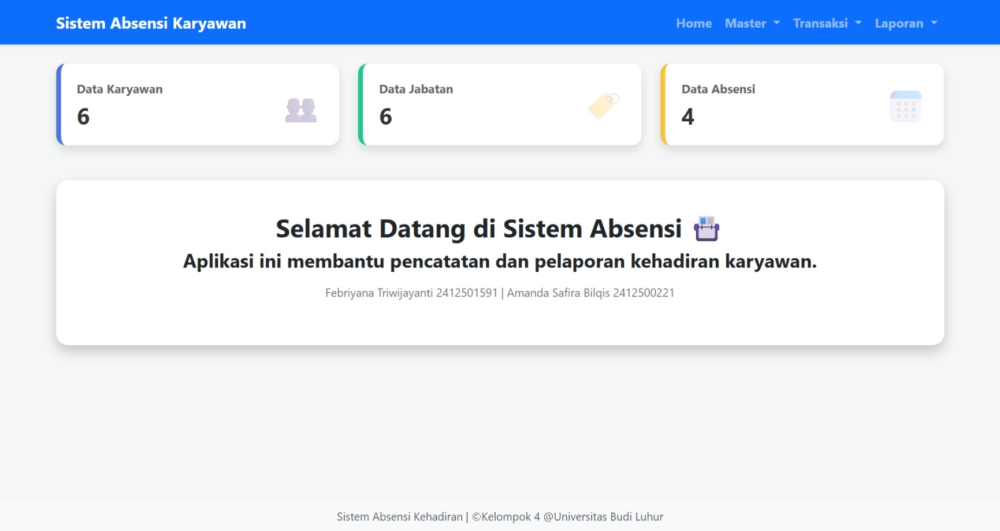
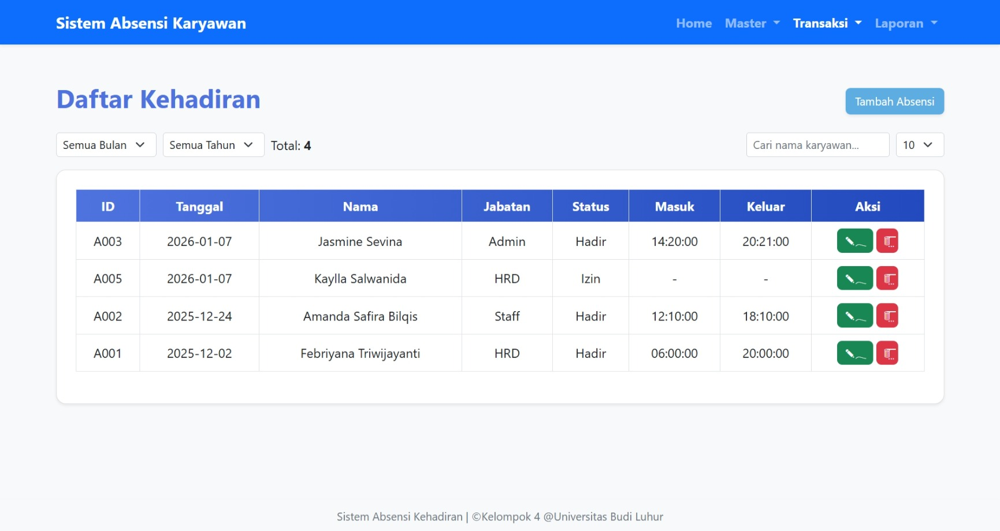
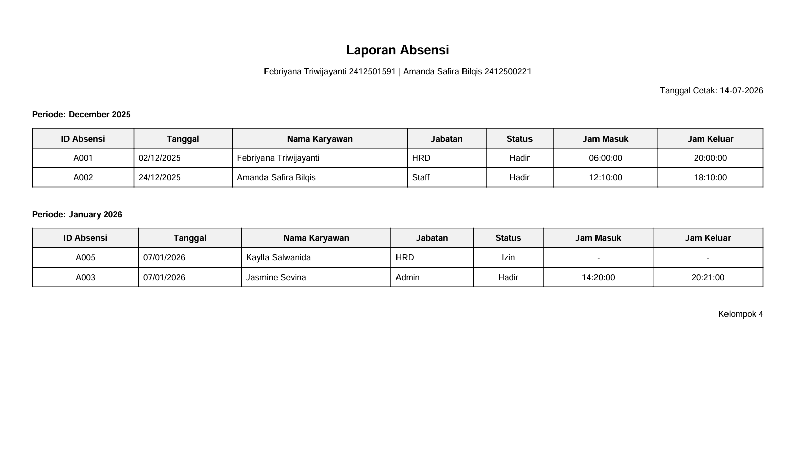

# Web-Based Attendance Information System

A web-based attendance information system developed using **PHP, CodeIgniter 4, and MySQL**. The application provides authentication, attendance management, CRUD operations, and reporting features through a responsive web interface.

---

## Features

- Attendance management
- CRUD operations
- Reporting and data management
- Responsive web interface

---

## 🛠️ Tech Stack

- PHP
- CodeIgniter 4
- MySQL
- HTML
- CSS
- JavaScript

---

## Application Preview

### Home



### Attendance



### Report



---

## Project Structure

```text
web-based-attendance-information-system
│
├── app/
├── public/
├── database/
├── screenshots/
├── README.md
├── LICENSE
├── composer.json
└── composer.lock
```

---

## Installation

1. Clone this repository.
2. Install dependencies using Composer.
3. Import the database from `database/db_uas_klp4.sql`.
4. Configure the `.env` file.
5. Run the application using CodeIgniter 4.

---

Information Systems Student at Universitas Budi Luhur
